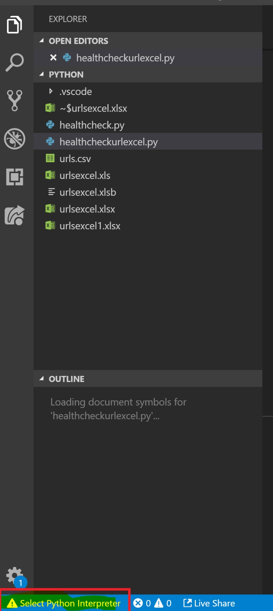
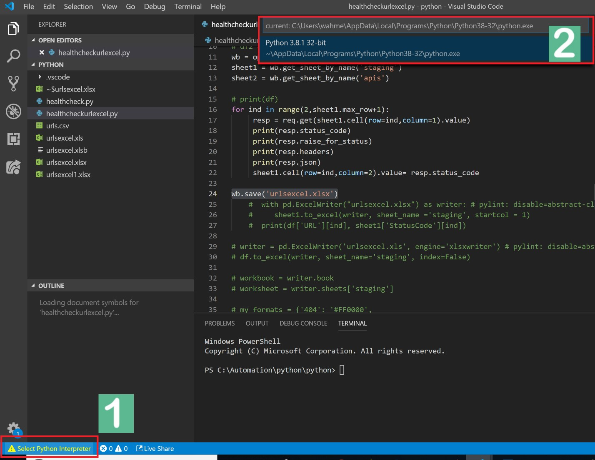
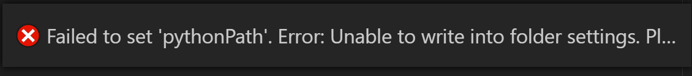
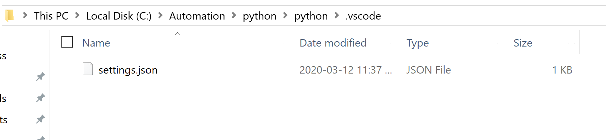
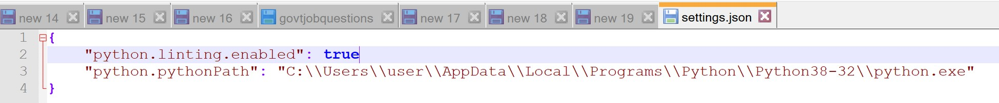
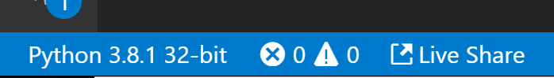
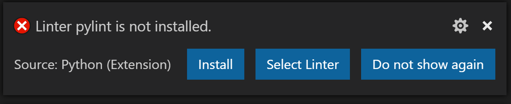
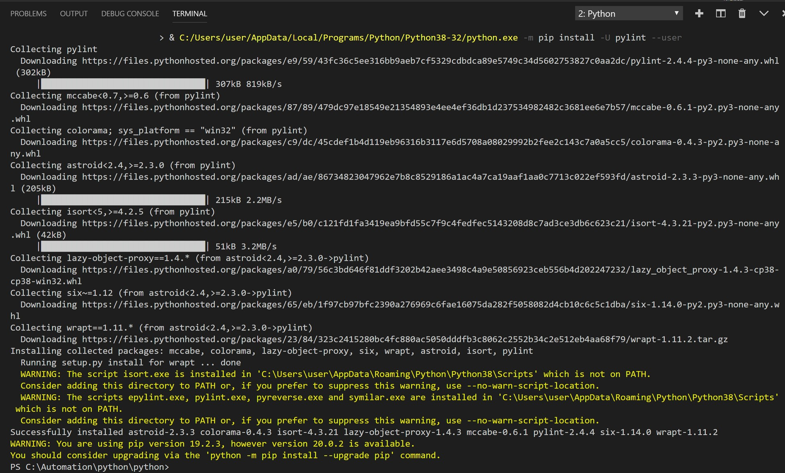
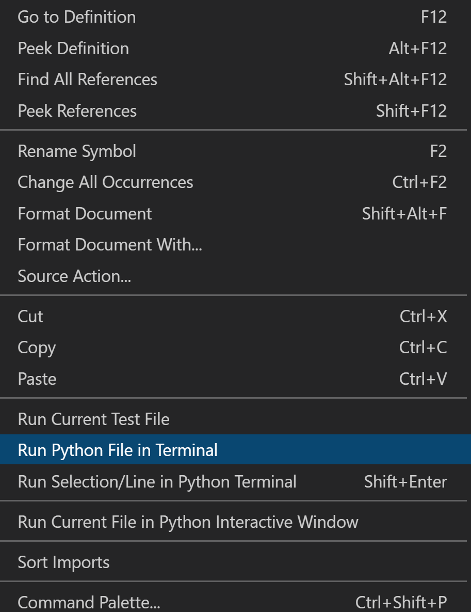
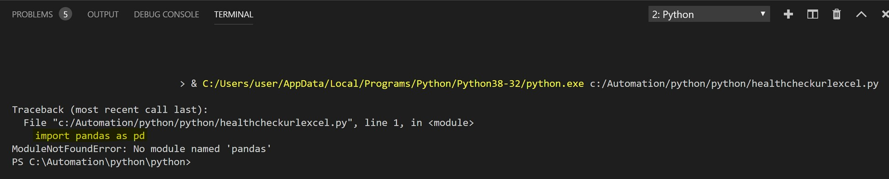

## Installations & Setup Steps:
* Install python from here https://www.python.org/downloads/

* Set paths for python directory and scripts where pip is in windows environment variables
Directory where python is installed:

 

Directory where scripts like pip are:

 

Now set these paths in PATH under System variables:

 

* IDE – Visual Studio Code Installation

Go to https://code.visualstudio.com/.Click Download for Windows

 

Click Save

 

Click Run

 

Select “I accept the agreement”. Than Click Next

 

Click Next

 

Click Next

 

Click Next

 

Click Install

 

Click Finish

 

## VS Code Configuration:

Now launch VS code IDE and open the python folder containing script. You will
notice it will prompt you to set interpreter

First click on it and you will see the prompt on top and select the path for python

 

You will notice this error prompt

 

In order to fix this manually we will set the path in settings.json file in your
project folder. Navigate to project folder in my case its here. You will see
the .vscode folder, open it

 

You will see the settings.json file. Now open this in notepad++

 

It will look like this

 

Just add the ‘,‘ at the end of first line after true and ensure python.pythonPath
points to where python application is residing.
Save and close this file. Close VScode and relaunch you might have to re-add the interpreter sometimes it takes time for VSCode to read path. Once its
set you will notice in the same place displaying correct version of python installed

 

Next you will see an error prompt for pylint requesting to install Click on install

 

Pylint is a tool that checks for errors in Python code, tries to enforce a coding
standard and looks for code smells. It can also look for certain type errors, it can
recommend suggestions about how particular blocks can be refactored and can
offer you details about the code's complexity.

You will see it installing pylint

 

Now close VScode and re-launch it.

## Pre-requisite Python Modules Installation:

4. Now install the following python libraries:

Lets try to run code. Right click in the script area and select Run Python File in
Terminal

 

You will notice in the terminal it states we have imported pandas but not installed the library

 

On the terminal type the following commands:

pip install pandas

pip install requests

pip install xlsxwriter

pip install xlrd

pip install openpyxl