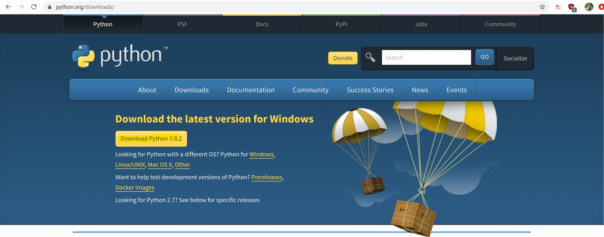
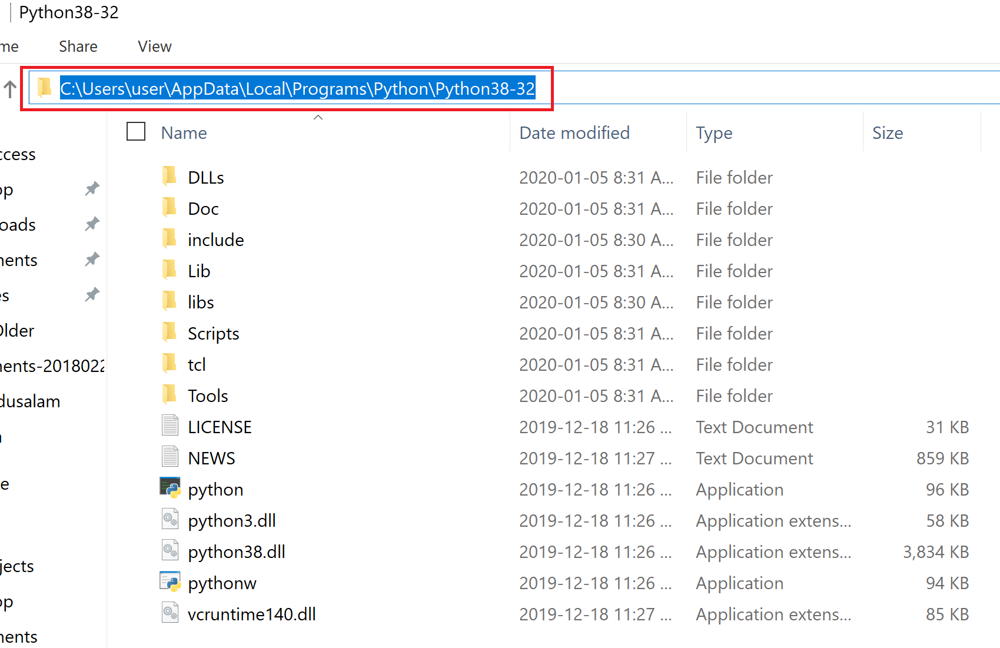
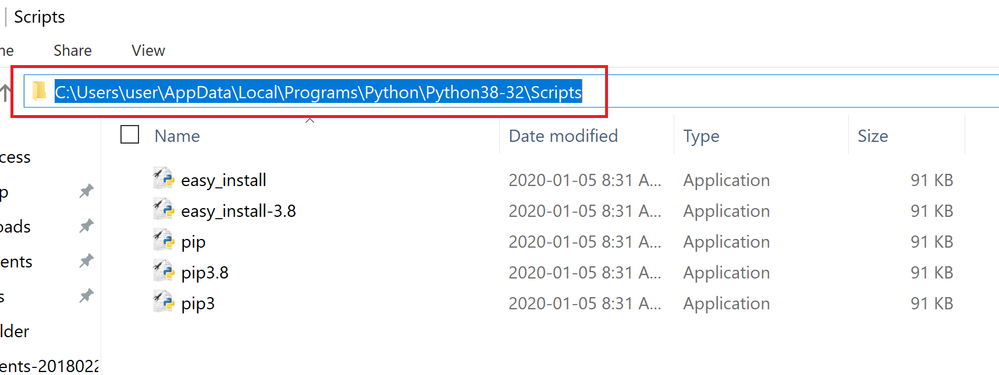

## Installations & Setup Steps:
* Install python from here https://www.python.org/downloads/

* Set paths for python directory and scripts where pip is in windows environment variables
Directory where python is installed:
 

Directory where scripts like pip are:
 