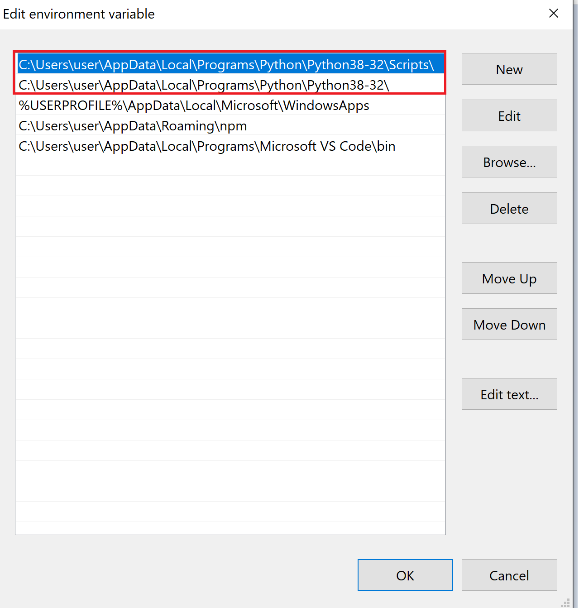
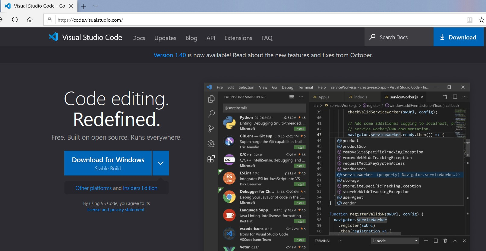
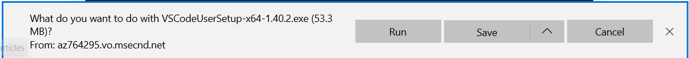
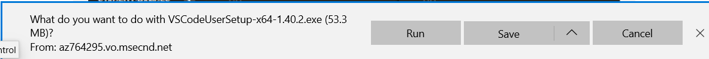
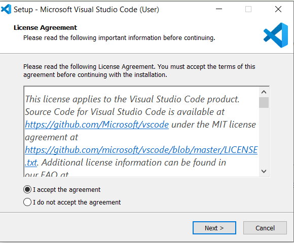
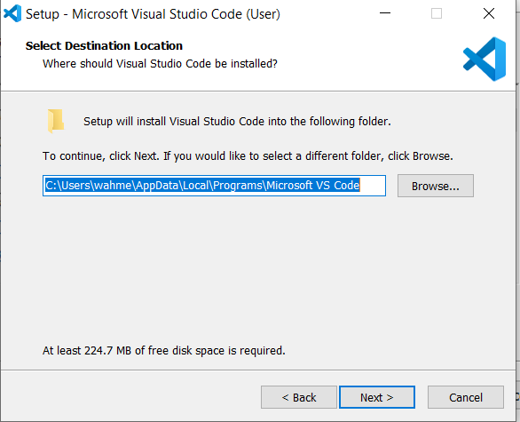
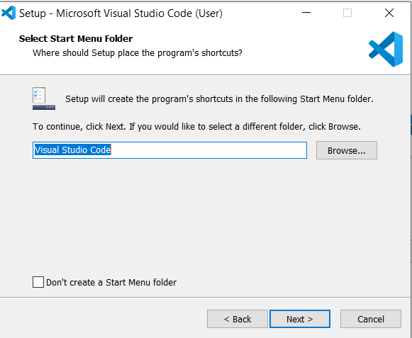
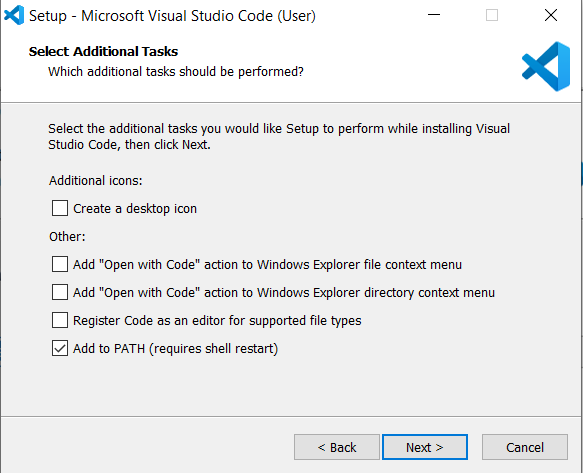
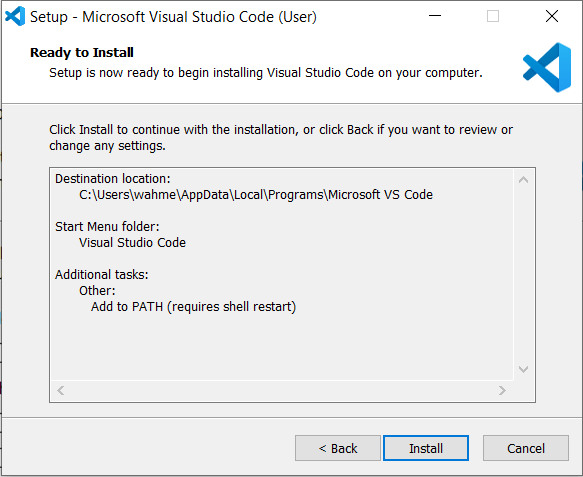
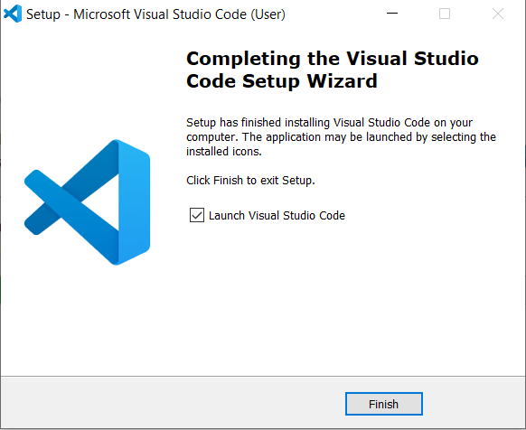

## Installations & Setup Steps:
* Install python from here https://www.python.org/downloads/

* Set paths for python directory and scripts where pip is in windows environment variables
Directory where python is installed:

 

Directory where scripts like pip are:

 

Now set these paths in PATH under System variables:

 

* IDE – Visual Studio Code Installation

Go to https://code.visualstudio.com/.Click Download for Windows

 

Click Save

 

Click Run

 

Select “I accept the agreement”. Than Click Next

 

Click Next

 

Click Next

 

Click Next

 

Click Install

 

Click Finish

 

## VS Code Configuration:

Now launch VS code IDE and open the python folder containing script. You will
notice it will prompt you to set interpreter